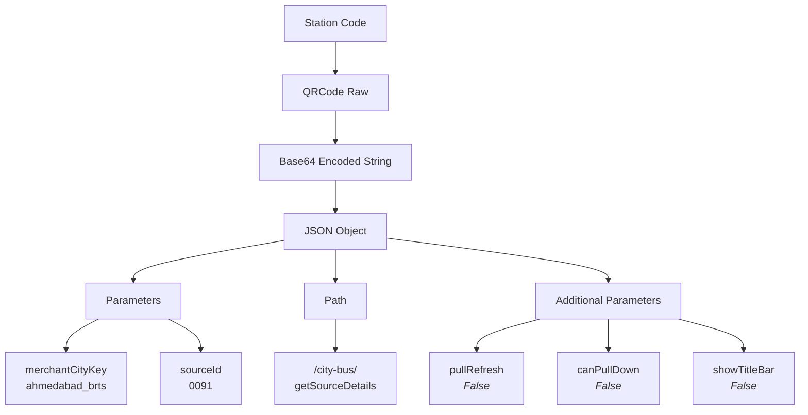

# Paytm QR Code Decoder

## Overview

This repository contains a Python implementation for decoding Paytm QR codes used in city bus services.

## Features

* Decodes Paytm Mini App QR codes
* Parses JSON structure
* Handles base64 decoding
* Extracts all parameters

## Installation

```bash
pip install base64 json urllib3
```

## Usage

```python
import base64
import json
from urllib.parse import parse_qs

def decode_paytm_qr(qr_data):
    # Extract the data part from QR code URL
    data_part = qr_data.split('data=')[1]
    
    # Decode base64
    decoded_bytes = base64.b64decode(data_part)
    decoded_str = decoded_bytes.decode('utf-8')
    
    # Parse JSON
    json_data = json.loads(decoded_str)
    
    # Parse URL parameters
    params_dict = parse_qs(json_data['params'].strip('?'))
    
    return {
        'path': json_data['path'],
        'params': {k: v[0] for k, v in params_dict.items()},
        'sparams': json_data['sparams']
    }

# Example usage
qr_data = "paytmmp://mini-app?aId=77a7aa36c00e469482a6219004fde717&data=eyJwYXJhbXMiOiI/bWVyY2hhbnRDaXR5S2V5PWFobWVkYWJhZF9icnRzJnNvdXJjZUlkPTAwOTEiLCJwYXRoIjoiL2NpdHktYnVzL2dldFNvdXJjZURldGFpbHMiLCJzcGFyYW1zIjp7InB1bGxSZWZyZXNoIjpmYWxzZSwiY2FuUHVsbERvd24iOmZhbHNlLCJzaG93VGl0bGVCYXIiOmZhbHNlfX0="
result = decode_paytm_qr(qr_data)
print(json.dumps(result, indent=2))
```

## Output


```json
{
  "path": "/city-bus/getSourceDetails",
  "params": {
    "merchantCityKey": "ahmedabad_brts",
    "sourceId": "0091"
  },
  "sparams": {
    "pullRefresh": false,
    "canPullDown": false,
    "showTitleBar": false
  }
}
```

## Data Flow
----



## Requirements

- Provide the QR raw data required for this project.
  - Example: "paytmmp://mini-app?aId=77a7aa36c00e469482a6219004fde717&data=eyJwYXJhbXMiOiI/bWVyY2hhbnRDaXR5S2V5PWFobWVkYWJhZF9icnRzJnNvdXJjZUlkPTAwOTEiLCJwYXRoIjoiL2NpdHktYnVzL2dldFNvdXJjZURldGFpbHMiLCJzcGFyYW1zIjp7InB1bGxSZWZyZXNoIjpmYWxzZSwiY2FuUHVsbERvd24iOmZhbHNlLCJzaG93VGl0bGVCYXIiOmZhbHNlfX0="

- Provide the station name and either:
  - The QR code image, or
  - The extracted QR payload (decoded content).
